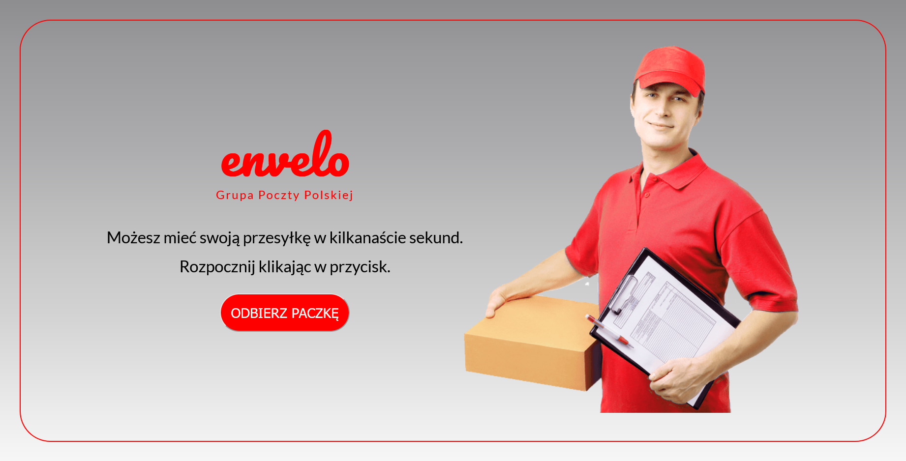
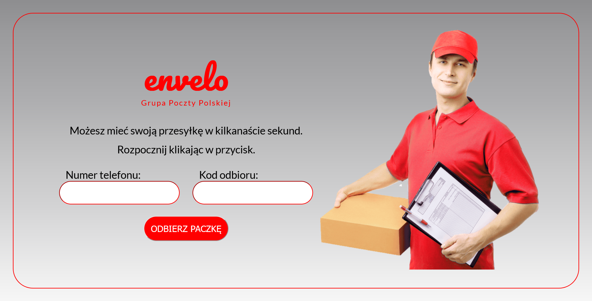
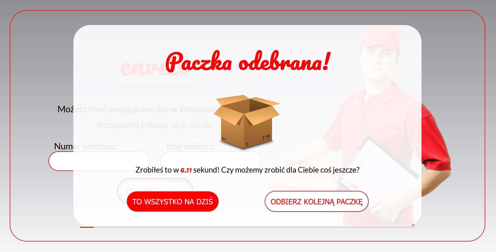
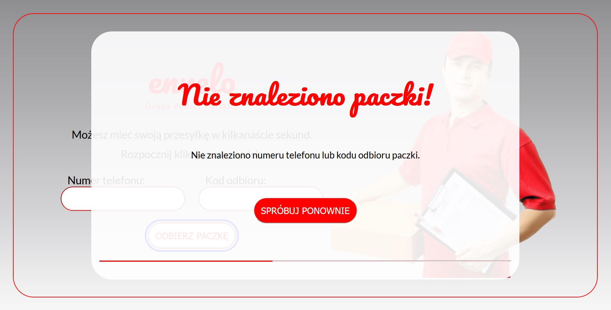

# Envelo - simple app for picking up parcels

Fully responsive application written in vanilla JS.

## ✨ Overview

### 📷 Screenshots

### 🎯 Features

- Form validation
- Modal with timer

### 🔎 Links

Visit the app at https://envelo-paczkomat-xxdbxx.netlify.app/

#### Phone number and key

📞 507123098 🔑 5643
📞 793793793 🔑 2022

### 🚀 Tech stack

- JavaScript
- CSS 3
- HTML 5
- Vite

## 🏃‍♀️ Run locally

### Clone the project

`git clone https://github.com/dboinska/envelo-paczkomat`

### Go to the project directory

`cd envelo-paczkomat`

### Install dependencies

`npm install`

### Start the server

`npm run dev`
